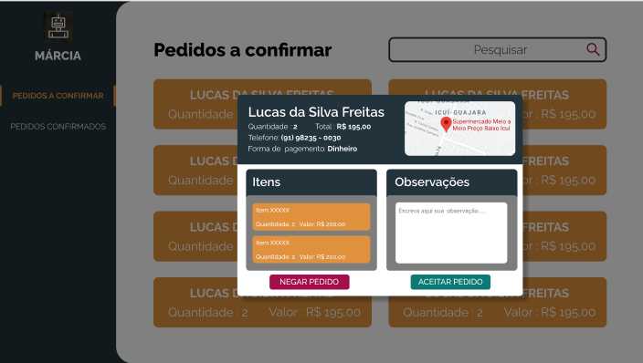
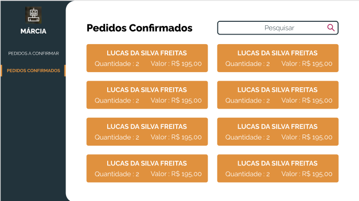

<h1 align="center">
     <a href="#" alt="MARCIA"> MARCIA BOT</a>
</h1>

## 🤖 Sobre o projeto
 MARCIA BOT, é um serviço que auxilia o atendimento residencial para Farmácias.

---
## ⚙️ Funcionalidades
  - Atendimento ao cliente via aplicativo de mensagem instantânea por meio do bot
    - Fazer pedido de remédios via bot
  - Interface para farmácia gerenciar os pedidos
    - Aceitar e recusar os pedidos
    - Visualizar os pedidos confirmados

---
## 🛠 Techs utilizadas
  - API
    - Java
    - PostgresSQL
  - Client
    - ReactJS
    - ElectronJS
    - TypeScript
  - Bot
    - Python
    - Selenium

---
## 🎨 Design
<table>
  <tr>
    <td colspan="2">Pedidos a confirmar</td>
  <tr>
  <tr>
    <td></td><td></td>
  </tr>
  <tr>
    <td colspan="2">Pedidos Confirmados</td>
  <tr>
  <tr>
    <td></td><td></td>
  </tr>
</table>

---
## 🦸 Equipe de desenvolvimento
  <table>
    <tr>
      <td></td>
      <td></td>
      <td>  </td>
      <td></td>
      <td></td>
    </tr>
    <tr>
      <td><a href="https://www.linkedin.com/in/brian-amaral-29013a200/">Brian Amaral</a></td>
      <td><a href="https://www.linkedin.com/in/lucas-freitas090/">Lucas Freitas</a></td>
      <td><a href="https://www.linkedin.com/in/elielson-barbosa-173323151/">Elielson Barbosa</a></td>
      <td><a href="https://www.linkedin.com/in/pedrolimma47821617/">Pedro Lima</a></td>
      <td><a href="https://www.linkedin.com/in/renanfigcarneiro/">Renan Carneiro</a></td>
    </tr>
  </table>
